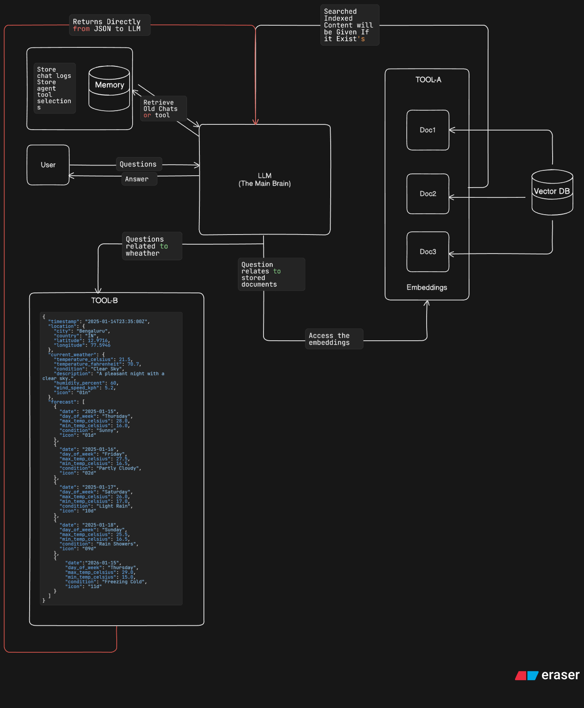

# Task 3 — Mini Agent Chatbot with Tool Use

## Project Overview

**Selected Task:** Task 3 - Mini Agent Chatbot with Tool Use

This project implements an intelligent chatbot agent with tool-calling capabilities using LangChain and FastAPI. The agent autonomously selects and uses appropriate tools to answer user queries, including:
- A technical knowledge base powered by RAG (Retrieval-Augmented Generation) for AI/technical questions
- A weather information tool for city-specific weather queries

The system maintains conversation history and tool usage logs in a SQL database, while using ChromaDB for semantic document search.



## Architecture Summary

The system consists of the following components:

### Components
1. **FastAPI Server** - RESTful API endpoints for chat and health checks
2. **LangChain Agent** - Orchestrates tool selection and response generation using `create_agent`
3. **Tools**:
   - **Technical Knowledge Base** - ChromaDB vector store with RAG for AI/technical queries
   - **Weather Tool** - JSON-based weather data retrieval
4. **Memory Systems**:
   - **SQL Database (SQLite)** - Stores chat history, tool usage logs, and session tracking
   - **ChromaDB** - Vector database for document embeddings and semantic search

### Data Flow
```
User Question → Agent → Tool Selection → Tool Execution → Response
                 ↓                           ↓
           SQL Memory ← ─ ─ ─ ─ ─ ─ ─ ─ ─ ─ ┘
                 ↓
        (Chat logs + Tool usage)
```

## Setup Instructions

### Prerequisites
- **Python Version:** 3.8 or higher (Python 3.10+ recommended)
- **Groq API Key:** Get a free API key from [console.groq.com/keys](https://console.groq.com/keys)
- **Bash Shell:** Git Bash on Windows, or native terminal on Linux/Mac

### Option 1: Automated Setup (Recommended)

```bash
# Make the script executable (Linux/Mac)
chmod +x setup.sh

# Run the setup script
./setup.sh
```

The script will:
- Create a virtual environment
- Install all dependencies
- Prompt for your Groq API key
- Create necessary directories
- Set up the .env file

### Option 2: Manual Setup

**Step 1: Create Virtual Environment**
```bash
# Create virtual environment
python -m venv venv

# Activate virtual environment
# On Windows (Command Prompt)
venv\Scripts\activate

# On Windows (PowerShell)
venv\Scripts\Activate.ps1

# On Linux/Mac
source venv/bin/activate
```

**Step 2: Install Dependencies**
```bash
# Upgrade pip (recommended)
pip install --upgrade pip

# Install all required packages
pip install -r requirements.txt
```

**Step 3: Configure Environment**
```bash
# Create .env file
echo "GROQ_API_KEY=your_api_key_here" > .env

# Edit .env and replace with your actual API key
```

**Step 4: Create Data Directories**
```bash
# Create necessary directories
mkdir -p data/documents
mkdir -p data/chroma_db

# (Optional) Add .md files to data/documents/ for knowledge base
```

### How to Run the API

```bash
# 1. Ensure virtual environment is activated
source venv/bin/activate  # Linux/Mac
# OR
venv\Scripts\activate  # Windows

# 2. Start the FastAPI server
python -m uvicorn app.main:app --reload

# The server will start at http://localhost:8000
# --reload flag enables auto-restart on code changes (development mode)
```

**Server Output:**
```
INFO:     Will watch for changes in these directories: ['C:\\Users\\...\\Test_asing']
INFO:     Uvicorn running on http://127.0.0.1:8000 (Press CTRL+C to quit)
INFO:     Started reloader process
INFO:     Started server process
INFO:     Waiting for application startup.
INFO:     Application startup complete.
```

**Access Points:**
- API Base: `http://localhost:8000`
- Interactive Docs (Swagger): `http://localhost:8000/docs`
- Alternative Docs (ReDoc): `http://localhost:8000/redoc`
- Health Check: `http://localhost:8000/health`

## How to Test Endpoints

### Using cURL

**1. Test Health Endpoint:**
```bash
curl http://localhost:8000/health
```

Expected response:
```json
{"status": "ok"}
```

**2. Test Chat Endpoint:**
```bash
# General question
curl -X POST http://localhost:8000/chat \
  -H "Content-Type: application/json" \
  -d '{"question":"Hello, who are you?"}'

# Technical question (uses knowledge base)
curl -X POST http://localhost:8000/chat \
  -H "Content-Type: application/json" \
  -d '{"question":"What is retrieval-augmented generation?"}'

# Weather question
curl -X POST http://localhost:8000/chat \
  -H "Content-Type: application/json" \
  -d '{"question":"What is the weather forecast for London?"}'
```

### Using Postman

**Import into Postman:**

1. Create a new request in Postman
2. Set method to `POST`
3. URL: `http://localhost:8000/chat`
4. Headers: Add `Content-Type: application/json`
5. Body: Select `raw` and `JSON`, then paste:
```json
{
  "question": "What is retrieval-augmented generation?"
}
```
6. Click "Send"

**Example Postman Collection (Import this JSON):**
```json
{
  "info": {
    "name": "Agent Chatbot API",
    "schema": "https://schema.getpostman.com/json/collection/v2.1.0/collection.json"
  },
  "item": [
    {
      "name": "Health Check",
      "request": {
        "method": "GET",
        "url": {"raw": "http://localhost:8000/health"}
      }
    },
    {
      "name": "Chat - Technical Question",
      "request": {
        "method": "POST",
        "header": [{"key": "Content-Type", "value": "application/json"}],
        "body": {
          "mode": "raw",
          "raw": "{\"question\":\"What is RAG?\"}"
        },
        "url": {"raw": "http://localhost:8000/chat"}
      }
    },
    {
      "name": "Chat - Weather Question",
      "request": {
        "method": "POST",
        "header": [{"key": "Content-Type", "value": "application/json"}],
        "body": {
          "mode": "raw",
          "raw": "{\"question\":\"What's the weather in London?\"}"
        },
        "url": {"raw": "http://localhost:8000/chat"}
      }
    }
  ]
}
```

### Using Swagger UI (Interactive Browser Testing)

1. Open your browser and navigate to: `http://localhost:8000/docs`
2. You'll see an interactive API documentation interface
3. Click on `/chat` endpoint
4. Click "Try it out"
5. Enter your question in the request body:
```json
{
  "question": "What is RAG?"
}
```
6. Click "Execute"
7. View the response below

### Verify Tool Usage

Check if tools are being called correctly:
```bash
# Question that should use the knowledge base tool
curl -X POST http://localhost:8000/chat \
  -H "Content-Type: application/json" \
  -d '{"question":"What is RAG?"}'

# Check the response for:
# - selected_tool: should show "technical_knowledge_base"
# - retrieved_context: should show document chunks

# Question that should use the weather tool
curl -X POST http://localhost:8000/chat \
  -H "Content-Type: application/json" \
  -d '{"question":"Which day has the lowest temperature?"}'

# Check the response for:
# - selected_tool: should show "get_weather"
```

### Check Database Logs

Verify that conversations are being stored:
```bash
# View recent chats
sqlite3 chat_memory.db "SELECT user_message, tool_used, timestamp FROM chat_logs ORDER BY timestamp DESC LIMIT 5;"

# View tool usage statistics
sqlite3 chat_memory.db "SELECT tool_name, COUNT(*) as count FROM tool_usage GROUP BY tool_name;"
```

## Optional Streamlit UI Setup

**Note:** This implementation does not include a Streamlit UI. The project is designed as a REST API service that can be accessed via:
- Direct HTTP requests (curl, Postman)
- Swagger UI at `/docs`
- Integration with any frontend framework
- Command-line tools

If you need a web interface, you can:
1. Use the built-in Swagger UI at `http://localhost:8000/docs`
2. Build a custom frontend using the `/chat` endpoint
3. Integrate with existing chat applications via the API

## Environment Variables Explanation

The application requires the following environment variables in a `.env` file:

| Variable | Required | Description | Example | Where to Get |
|----------|----------|-------------|---------|--------------|
| `GROQ_API_KEY` | Yes | API key for Groq LLM service | `gsk_abc123...` | [console.groq.com/keys](https://console.groq.com/keys) |

**How to Set:**

1. Create `.env` file in project root:
```bash
touch .env  # Linux/Mac
# or
type nul > .env  # Windows
```

2. Add your API key:
```bash
GROQ_API_KEY=gsk_your_actual_groq_api_key_here
```

3. Verify it's loaded:
   - The application will throw an error on startup if the key is missing
   - Check logs for: "GROQ_API_KEY not found" error

**Security Notes:**
- Never commit `.env` file to version control
- `.env` is already included in `.gitignore`
- Keep your API keys private and rotate them regularly
- The free Groq tier provides sufficient quota for testing and development

## Notes and Assumptions

### Design Decisions

1. **Agent Framework:**
   - Used LangChain's `create_agent` for simplified agent creation
   - Groq API chosen for fast inference and free tier availability
   - Model: `openai/gpt-oss-120b` for reliable tool calling

2. **Memory Architecture:**
   - **SQL Database (SQLite):** Persistent storage for chat logs and tool usage analytics
   - **ChromaDB:** Vector database for document embeddings and semantic search
   - No conversation memory across sessions (each request is stateless)
   - Tool results are not cached (fresh data on each query)

3. **Tool Selection:**
   - Agent autonomously selects tools based on query content
   - Two tools implemented:
     - Technical Knowledge Base (RAG) for AI/technical queries
     - Weather tool for city-specific weather data
   - Tools can be easily extended by adding new tool definitions

### Assumptions

1. **Data Sources:**
   - Weather data is static and stored in `data/weather.json`
   - Documents in `data/documents/` are markdown files
   - Document ingestion happens once at startup

2. **API Key:**
   - User has access to Groq API (free tier sufficient)
   - API key has sufficient quota for testing

3. **Environment:**
   - Single-user deployment (SQLite adequate)
   - Local development/testing environment
   - No authentication/authorization required
   - HTTP only (no HTTPS/TLS)

4. **Performance:**
   - Small document corpus (< 1000 files)
   - Low to moderate query volume
   - Synchronous request processing
   - No caching layer needed

5. **Limitations:**
   - No multi-turn conversation context (stateless)
   - No user authentication
   - No rate limiting
   - No production-grade error handling for external API failures
   - Weather data limited to predefined cities in JSON

### Known Issues

1. **create_agent response format:** Returns `{"messages": [...]}` instead of `{"output": "..."}`, requiring manual extraction in the response function
2. **Tool intermediate steps:** Not directly exposed by `create_agent`; tool usage tracking relies on database logs
3. **Document re-ingestion:** ChromaDB persistence check is basic; may re-ingest if directory structure changes

### Future Enhancements

If this were production-ready:
1. Add Redis caching for tool results
2. Implement conversation memory across sessions
3. Add user authentication and API keys
4. Switch to PostgreSQL for production database
5. Add rate limiting and request throttling
6. Implement comprehensive error handling and retries
7. Add monitoring and logging (e.g., Sentry, DataDog)
8. Deploy with Docker/Kubernetes
9. Add CI/CD pipeline
10. Implement tool result caching with TTL

## API Endpoints Reference

### POST `/chat`
Send a question to the chatbot agent.

**Request:**
```json
{
  "question": "What is retrieval-augmented generation?"
}
```

**Response:**
```json
{
  "selected_tool": "technical_knowledge_base",
  "response": "Retrieval-augmented generation (RAG) is...",
  "retrieved_context": "[Document chunks used for answering]"
}
```

### GET `/health`
Check API health status.

**Response:**
```json
{
  "status": "ok"
}
```

### GET `/docs`
Interactive API documentation (Swagger UI)

### GET `/redoc`
Alternative API documentation (ReDoc)

## Project Structure

```
.
├── app/
│   ├── main.py              # FastAPI application & endpoints
│   ├── api/
│   │   ├── routes.py        # API routes
│   │   └── validator.py     # Request validation
│   ├── core/
│   │   ├── config.py        # Configuration
│   │   └── security.py      # Security utilities
│   ├── database/
│   │   ├── sql_memory.py    # SQL chat memory
│   │   ├── vectordb.py      # ChromaDB interface
│   │   └── session.py       # Session management
│   ├── services/
│   │   ├── agent.py         # LangChain agent logic
│   │   ├── ingestion.py     # Document ingestion
│   │   ├── embedding.py     # Embedding service
│   │   └── block.py         # Additional services
│   └── tools/
│       ├── doc_tool.py      # Knowledge base retriever
│       └── weather_tool.py  # Weather data tool
├── data/
│   ├── documents/           # Place .md files here
│   ├── chroma_db/           # Vector DB storage (auto-created)
│   └── weather.json         # Weather data
├── setup.sh                 # Automated setup script
├── requirements.txt         # Python dependencies
├── .env                     # Environment variables (create this)
├── arch.png                 # Architecture diagram
└── README.md               # This file
```

## Troubleshooting

### "GROQ_API_KEY not found"
- Ensure `.env` file exists in the root directory
- Verify the key is in format: `GROQ_API_KEY=gsk_...`
- Check that `.env` is in the same directory as `main.py`'s parent

### "No documents found"
- Add `.md` files to `data/documents/`
- Restart the server to trigger ingestion
- Check console logs for ingestion status

### ChromaDB errors
- Delete `data/chroma_db/` and restart to re-ingest
- Ensure `sentence-transformers` is installed
- Check disk space availability

### Port already in use
```bash
# Use a different port
uvicorn app.main:app --port 8001
```

### Import errors
```bash
# Ensure virtual environment is activated
source venv/bin/activate  # Linux/Mac
venv\Scripts\activate  # Windows

# Reinstall dependencies
pip install -r requirements.txt
```

## License

This project is for educational purposes.


